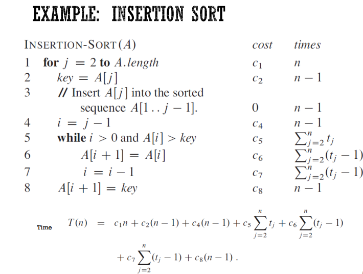
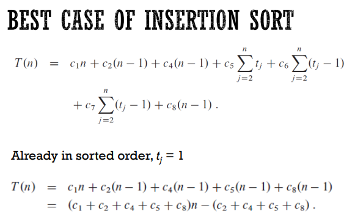
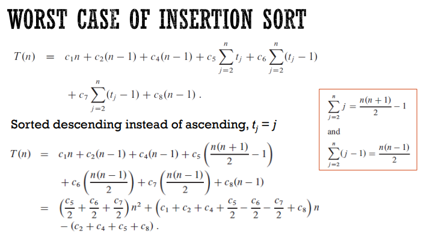

# Foundations

## Loop Invariants

1. Initialization

> Memastikan bernilai true untuk iterasi pertama

2. Maintenance

> Memastikan bernilai true untuk setiap iterasi

3. Termination

> Memastikan bernilai true setelah loop selesai

## Running Time Analysis

4. Urutan Growth Rates

    - Konstanta
    - Logaritma
    - Poli-logaritma
    - n
    - n log n
    - polinomial
    - eksponensial
    - faktorial
    - double eksponensial

5. Aturan Penyederhanaan

    - Hapus low-order terms
    - Hapus Multiplicative Constant
    - Abaikan konstan
