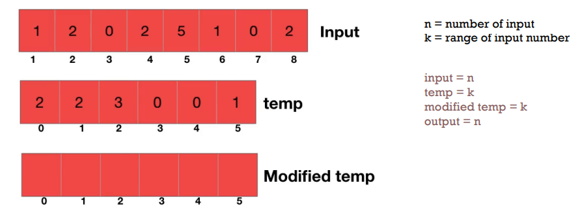
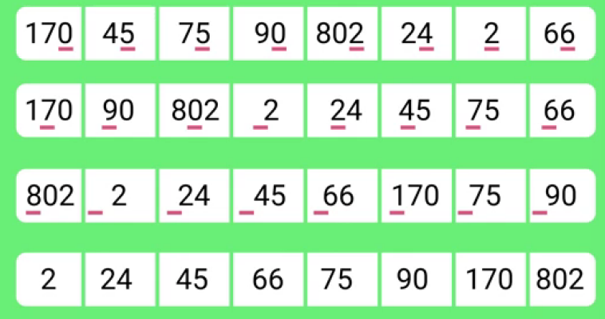
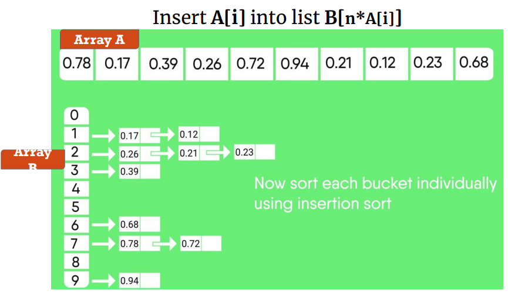
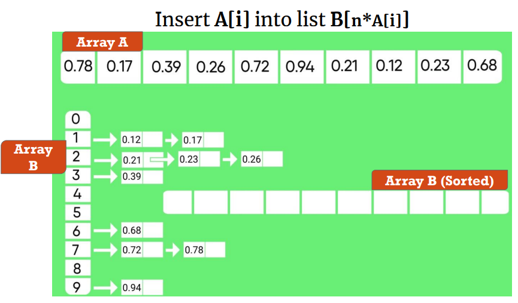
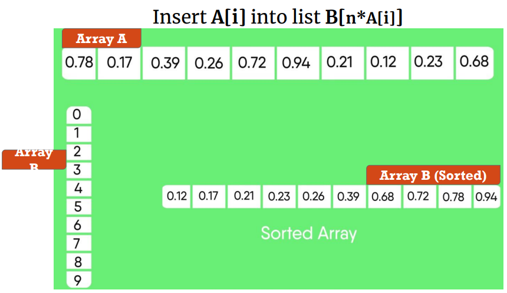

# Counting Sort

Algoritma Iterative Sorting yang bekerja dengan menghitung jumlah kemunculan elemen dalam array dan mempetakannya sebagai index dari auxiliary array. **Termasuk Stable Sort**.

## Visualisasi

## Running Time

$$
\theta (k + n)
$$

karena k = O(n), maka

$$
\theta (n)
$$

# Radix Sort

Radix Sort adalah jenis Iterative Sorting yang mengurutkan elemen berdasarkan digitnya. LSD (Least Significant Digit) mengurutkan dari digit terkanan, sedangkan MSD (Most Significant Digit) mengurutkkan dari digit terkiri.

## Visualisasi

## Running Time

$$
\theta (d(n+k))
$$

Jika menggunakan **stable sort**, maka

$$
\theta (n+k)
$$

# Bucket Sort

Bucket Sort adalah jenis iterative Sorting yang mengurutkan data berdasarkan kelompok-kelompok (bucket) dengan range yang seragam

## Visualisasi

## Running Time

$$
\theta (n)
$$